# AWS S3 Mini Project

This project provides hands-on experience with **Amazon S3**, covering core concepts like **buckets, objects, versioning, permissions, and lifecycle policies**.

---

## 🧭 Part 1: Create a New S3 Bucket

1. Search for `S3` in the AWS Console.

   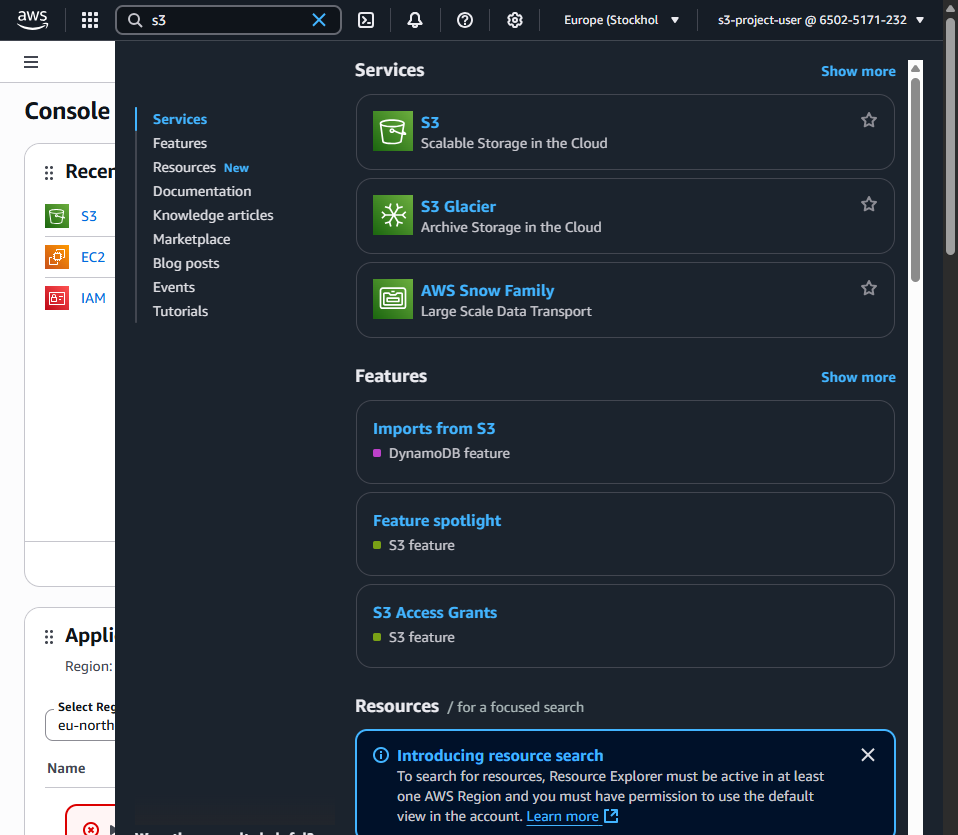

2. Click **Create bucket**.

   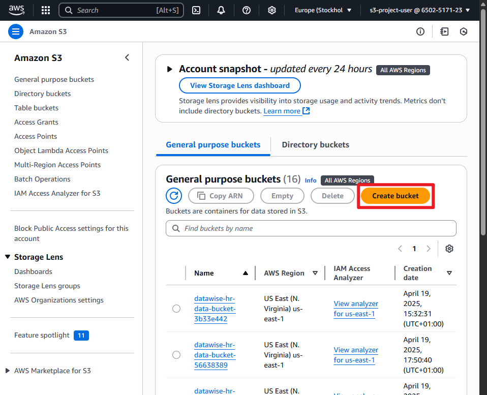

3. Set a unique **Bucket name** (`my-first-s3-bucket-drix`).

   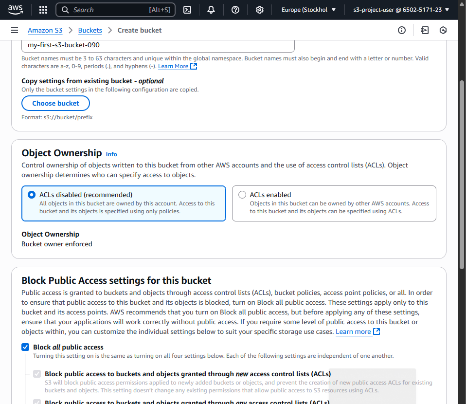

4. Set **Object Ownership** to `ACLs disabled`.

5. Leave **Block all public access** checked.

6. Leave **Versioning disabled** for now.

7. Click **Create bucket**.

   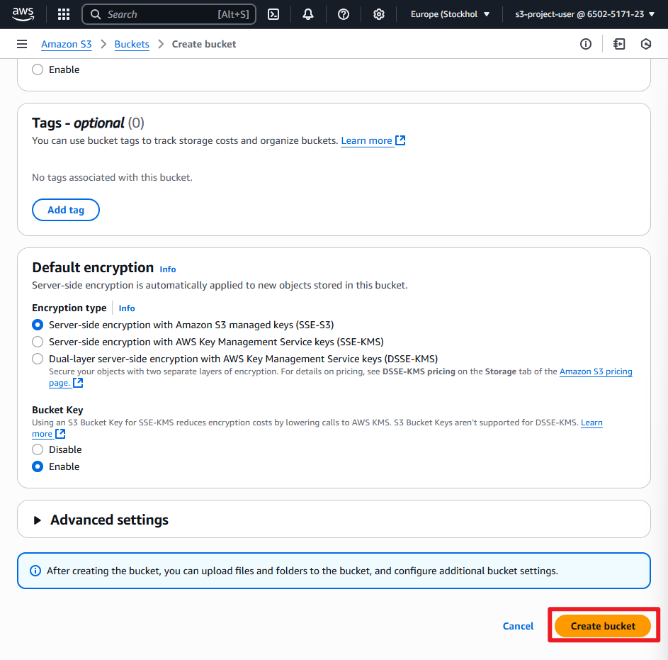

---

## 📁 Part 2: Upload an Object to the Bucket

1. Click the bucket name (`my-first-s3-bucket-drix`) to open it.

   

2. Click **Upload** → **Add files** → select a local file.

   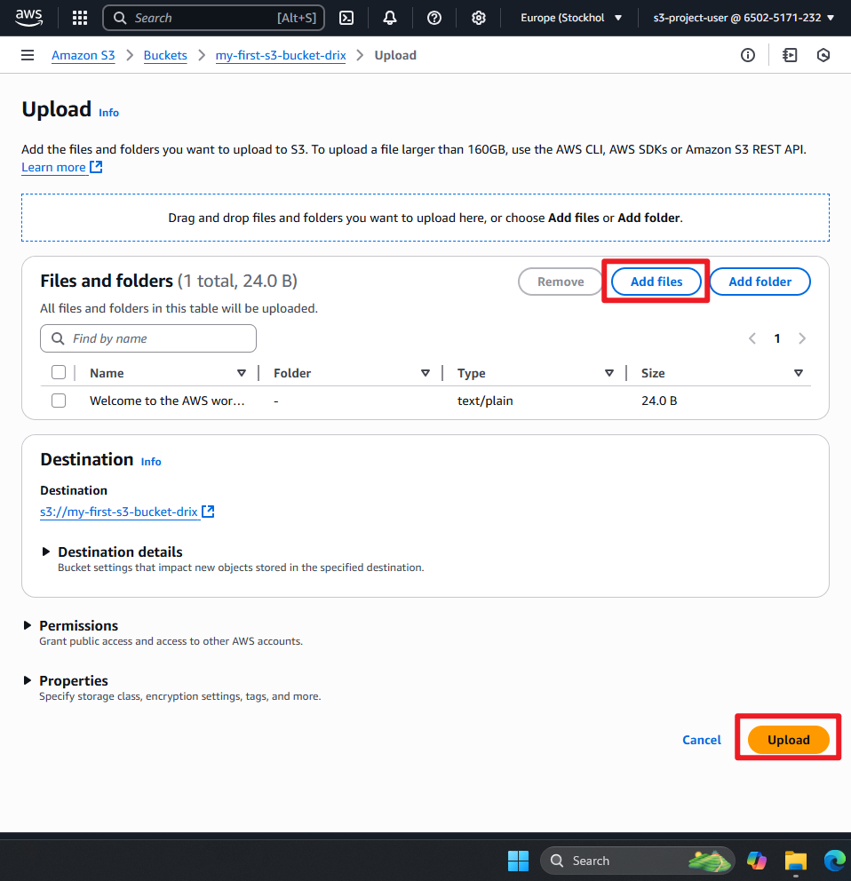

3. Click **Upload** to finish.

   

---

## 🔄 Part 3: Enable Versioning

1. Open the **Properties** tab in the bucket.

   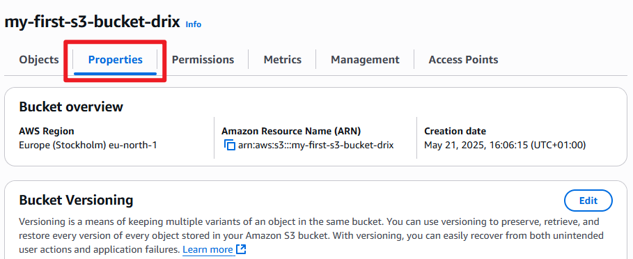

2. Scroll to **Bucket Versioning** → Click **Edit**.

   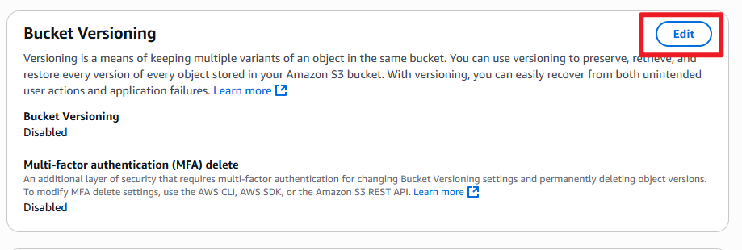

3. Enable it, then click **Save changes**.

   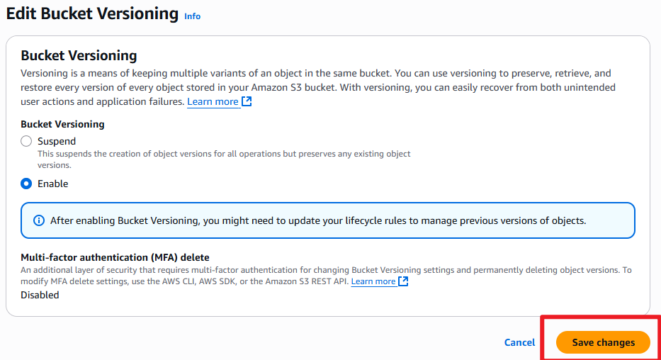

4. Re-upload the same file to create a new version.

5. Click **Show versions** to view history.

   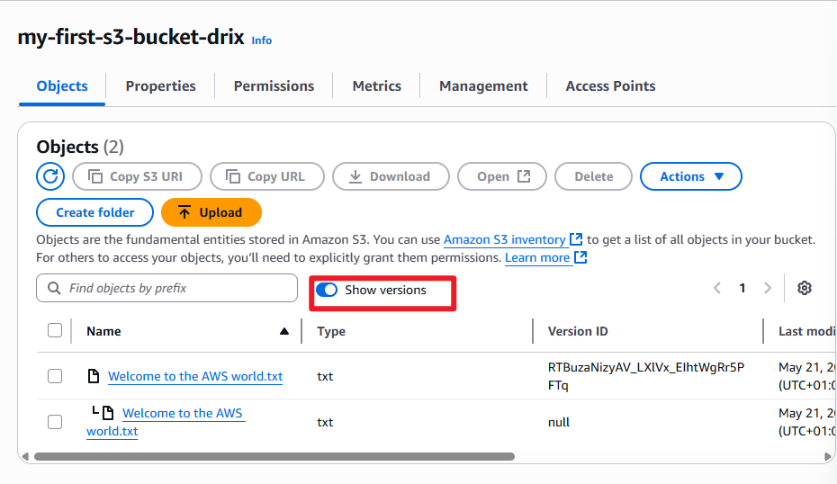

---

## 🔐 Part 4: Set Bucket Policy for Public Access

1. Go to the **Permissions** tab → **Block public access** section.
   
2. Click **Edit** and uncheck **Block all public access**.
3. Click **Save changes**.
   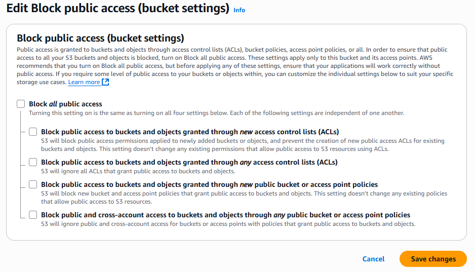

4. Go to **Permissions** → **Bucket policy** tab.

   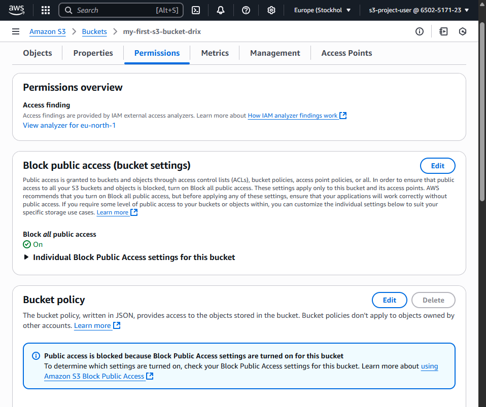

5. Use the **Policy Generator** or paste this policy manually:

```json
{
  "Id": "Policy1714394236530",
  "Version": "2012-10-17",
  "Statement": [
    {
      "Sid": "Stmt1714394172266",
      "Effect": "Allow",
      "Principal": "*",
      "Action": ["s3:GetObject", "s3:GetObjectVersion"],
      "Resource": "arn:aws:s3:::my-first-s3-bucket-drix/*"
    }
  ]
}
```

   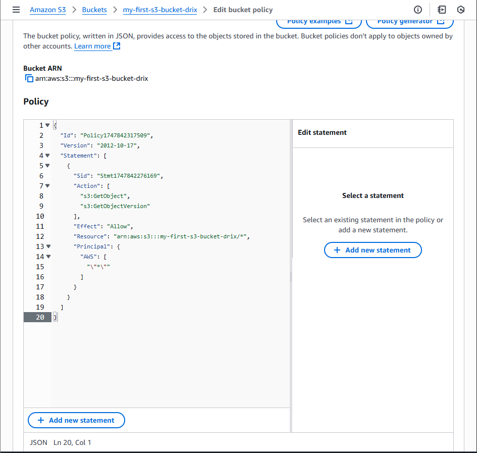

3. Click **Save changes**, then type `"confirm"` to apply.

   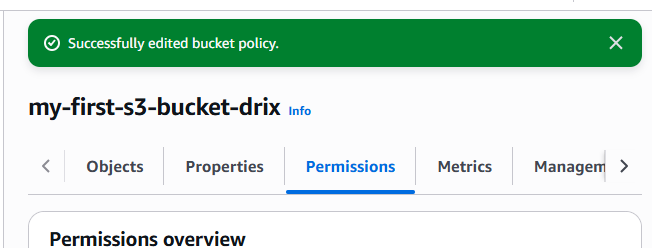

4. Now click on an object URL to test public access.

   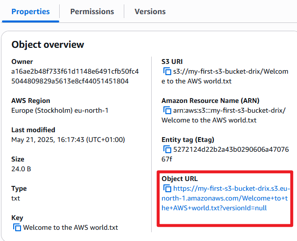

---

## ♻️ Part 5: Create a Lifecycle Rule

1. Go to **Management** → Click **Create lifecycle rule**.

   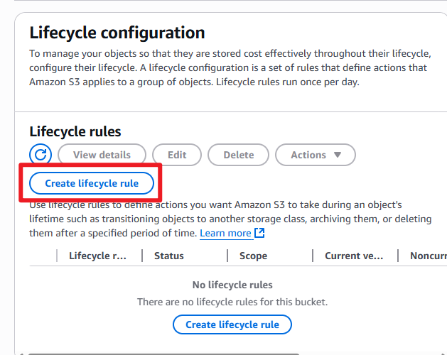

2. Name the rule (e.g., 'my-lifecycle-rule').

3. Choose limit the scope of this rule using one or more filters.

4. Select **Transition current versions of objects** to **Standard-IA** after 30 days.

   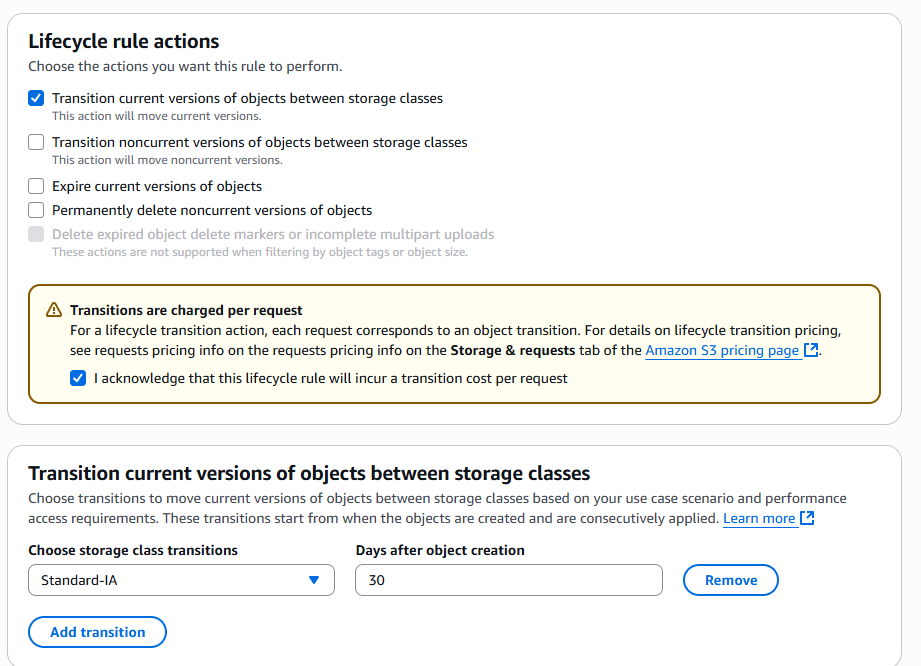

5. Click **Create rule** to save.

   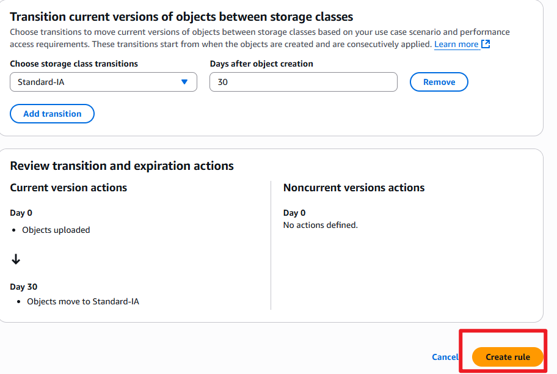

---

## ✅ Project Reflection

Participants:
- I gained hands-on experience with S3 buckets and objects.
- I learned key concepts like **versioning**, **permissions**, and **lifecycle management**.
- I understood how to manage access and optimize storage costs in real-world AWS use cases.
